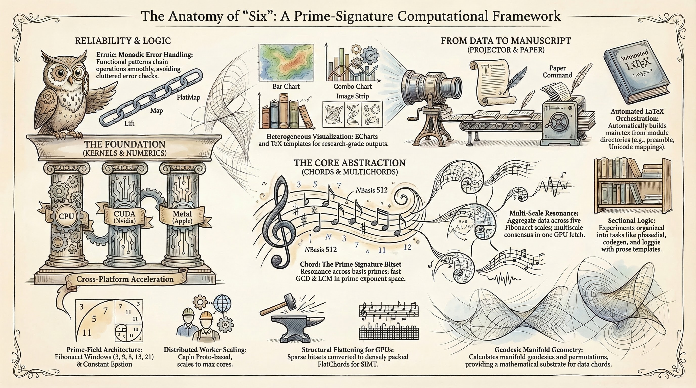

<p align="center">
  
</p>

<h1 align="center">six</h1>

<p align="center">
  <strong>A native state machine that replaces gradient descent with modular arithmetic.</strong><br/>
  257-bit Fermat field · Morton spatial indexing · Generative rotational logic
</p>

<p align="center">
  <a href="#quick-start">Quick Start</a> ·
  <a href="#core-thesis">Core Thesis</a> ·
  <a href="#architecture">Architecture</a> ·
  <a href="#codebase-map">Codebase Map</a> ·
  <a href="#experiments">Experiments</a> ·
  <a href="#roadmap">Roadmap</a>
</p>

---

> [!NOTE]
> This is a research project under active development.
> Certain architectural decisions are built for speed, not for comfort.
> The project actively seeks critique and feedback.

---

## Core Thesis

This project started from a single question:

> **Can we reject gradient descent and backpropagation long enough to convince ourselves that we may not need them?**

The answer is a holographic content addressable memory (HCAM) structure built on the 4th Fermat prime ($2^8 + 1 = 257$). In this field, every non-zero element has a multiplicative inverse, rotations are primitive operations with no dead zones, and collision between stored values **is** compression.

The system does not predict the next token. It solves for the **longest span** — a Boundary Value Problem where the architecture extends a cantilever into unknown territory and locks onto the nearest stable resonance in its stored memory.

### The Three Pillars

| Pillar | One-Liner | Mathematical Basis |
|:---|:---|:---|
| **Collision IS Compression** | Multiple byte sequences that share `(byte, localDepth)` collapse onto the same cell. The value carries continuation logic, not redundant identity. | A radix cell address `(byte, localDepth)` resets at each sequencer boundary. Observed: 52.8× compression on CIFAR-10. |
| **Rotation IS Data** | Sequence order is encoded as generative coordinate transforms, not positional tags. No XOR composition — rotation preserves structure. | $f(x) = (ax + b) \bmod{257}$ — an affine group with ~65K distinct states. Rotation produces translation. |
| **Resonance IS Retrieval** | Queries don't search; they excite the field at a frequency and follow constructive interference. | `popcount(A & B)` = dot product of binary vectors = Hamming similarity. XOR is measurement, never storage. |

### Why Not Semantics?

This project **deliberately rejects** optimizing for language semantics as a reasoning substrate.

The reasoning is simple arithmetic. A human vocabulary is roughly $10^5$ words. The 257-bit native value type has $2^{257} \approx 2.3 \times 10^{77}$ possible states — that is more distinct configurations than there are atoms in the observable universe. Optimizing the system to reason in human language would be like building a particle accelerator and then using it to crack walnuts.

> [!IMPORTANT]
> Semantics puts a **human ceiling** on the system. If the machine reasons in words, it can at best match human-level intelligence. If it reasons in its native monotype — a 257-bit value in GF(257), evolved by affine rotation, measured by Hamming distance — there is no ceiling. The representational capacity is not comparable.

The system does not parse meaning. It does not build ontologies. It does not model synonyms or grammar rules internally. When the code *does* parse S-V-O structure or inject semantic facts, that is a **projection layer** — a translator between the machine's native geometry and the much smaller space of human language. The projection exists so humans can read the output and evaluate experiments. It is the GUI, not the CPU.

The doctrine in three lines:

```
The LSM is address space, not intelligence.
The value is intelligence, not payload.
Semantics is projection, not ontology.
```

---

## Mathematical Foundations

GitHub renders LaTeX natively. The math below is the complete algebraic substrate — every operation the system performs reduces to one of these.

### The Field: $\text{GF}(257)$

$257$ is the 4th Fermat prime: $2^{2^3} + 1 = 2^8 + 1 = 257$. This gives the field two critical hardware properties:

$$a \bmod 257 = (a \land \text{0xFF}) - (a \gg 8) \quad \text{(branchless reduction)}$$

$$\forall\, a \in [1, 256]: \quad a^{-1} \equiv a^{255} \pmod{257} \quad \text{(Fermat's Little Theorem)}$$

Every non-zero element has a multiplicative inverse. No dead zones, no special cases, no division hardware needed.

### Affine Rotations (The Native Instruction Set)

The system's core operation is an affine transform over the field:

$$f(x) = (a \cdot x + b) \bmod{257}, \quad a \in [1, 256],\; b \in [0, 256]$$

where $a$ is derived from the primitive root $g = 3$ via $a = g^k \bmod 257$.

- **Composition** is $O(1)$: applying $f_1$ then $f_2$ yields a single $(a', b')$ pair:

$$a' = a_2 \cdot a_1 \bmod{257}, \quad b' = (a_2 \cdot b_1 + b_2) \bmod{257}$$

- **Inversion** is $O(1)$: $f^{-1}(y) = a^{-1}(y - b) \bmod{257}$

The affine group has $257 \times 256 = 65{,}792$ distinct transforms — enough to encode rich sequential and structural relationships without ever leaving integer arithmetic.

### BaseChord Geometry

Each byte value $v \in [0, 255]$ maps to a **5-sparse** bitset on the 257-bit field. The five bit positions are derived from a pre-computed offset table that distributes values across the faces of a 257-face polytope:

$$\text{BaseChord}(v) = \{b_0(v),\; b_1(v),\; b_2(v),\; b_3(v),\; b_4(v)\} \subset [0, 256]$$

This is a deterministic geometric address — no hashing, no learned embedding, no collision indirection. Each chord is **5-sparse on a 257-bit field** — five bits set out of 257 possible positions, not a 5-bit value.

### Morton Addressing & Radix Compression

A cell address packs byte identity and boundary-local depth into a single 64-bit key:

$$\text{CellKey} = \text{Pack}(\underbrace{v}_{\text{byte value (X)}},\; \underbrace{d}_{\text{local depth (Y)}})$$

The primary layout is `(symbol << 32) | localDepth` — a direct concatenation for O(1) pack/unpack that preserves byte-ordered scan locality. A separate `Encode3D()` utility provides true Z-order interleaved Morton curves for higher-dimensional spatial queries.

The local depth $d$ **resets to 0** at each sequencer boundary. This means distinct byte sequences that share $(v, d)$ collapse onto the same cell:

$$|\text{cells}| \ll |\text{tokens}| \quad \Rightarrow \quad \text{compression ratio} = \frac{|\text{tokens}|}{|\text{cells}|}$$

Observed: **52.8× compression** on CIFAR-10.

### Resonance Search (Measurement)

Retrieval is a Hamming-space similarity measurement:

$$\text{similarity}(A, B) = \text{popcount}(A \land B)$$

$$\text{distance}(A, B) = \text{popcount}(A \oplus B)$$

XOR ($\oplus$) is used **only** for measurement — comparing a projected rotation against a stored anchor. It is never used for composition or storage, because XOR invites Shannon entropy and destroys the generative properties of the rotational algebra.

### Algebraic Cancellation

Given stored facts as multiplicative braids in $\text{GF}(257)$:

$$\phi_{\text{stored}} = (\text{Roy} \cdot \text{is}\_\text{in} \cdot \text{Kitchen}) \bmod{257}$$

A prompt asking "Where is Roy?" computes the modular inverse cancellation:

$$\text{result} = \phi_{\text{stored}} \cdot \text{Roy}^{-1} \cdot \text{is}\_\text{in}^{-1} \bmod{257}$$

The shared structure cancels algebraically:

$$\text{result} = \text{Kitchen} \bmod{257}$$

This is not search. It is calculation.

> [!NOTE]
> **Dual algebra.** Algebraic cancellation operates on **scalar phases** — single elements of GF(257) (`numeric.Phase`, a `uint32`). This is distinct from 257-bit **chord** operations (OR, AND, XOR) which act on the full bitset for resonance measurement and superposition. The system has two parallel algebras: scalar GF(257) arithmetic for fact braids and modular reasoning, and 257-bit Hamming-space operations for structural resonance.

### Frustration (The Drive Signal)

When the system "believes" it should be at target phase $\phi_t$ but is actually at current phase $\phi_c$, the frustration is the **unresolved rotation**:

$$\Delta = \phi_t \cdot \phi_c^{-1} \bmod{257}$$

When $\Delta = 1$, the system is phase-locked (frustration zeroed). When $\Delta \neq 1$, the system searches its macro-index for a tool whose rotation matches $\Delta$.

### Tool Synthesis

When the cantilever hits a gap it cannot bridge, the missing tool is:

$$Z = \phi_{\text{goal}} \cdot \phi_{\text{failed}}^{-1} \bmod{257}$$

If applying $Z$ consistently bridges similar gaps across the Morton index, it is hardened as a permanent macro-opcode.

### Multi-Context Merging (Superposition)

Multiple facts coexist in a single cell via additive superposition:

$$\phi_{\text{merged}} = (\phi_A + \phi_B) \bmod{257}$$

Because $257$ is prime, the merged state preserves the spectral signature of both facts. Querying with the inverse of one fact isolates the other:

$$\phi_{\text{merged}} \cdot \phi_A^{-1} \bmod{257} \approx \phi_B$$

### Negative Constraints (Destructive Interference)

"Roy is NOT in the kitchen" is an **anti-chord** — the additive inverse:

$$\phi_{\text{neg}} = (257 - \phi_{\text{pos}}) \bmod{257}$$

When the wavefront encounters $\phi_{\text{neg}}$, the positive momentum meets the anti-phase:

$$\phi_{\text{pos}} + \phi_{\text{neg}} \equiv 0 \pmod{257}$$

The path energy drops to zero. The branch is pruned by destructive interference, not by a boolean flag.

---

## Architecture

The system is organized into four conceptual planes, implemented across two package trees.

```
┌─────────────────────────────────────────────────────────┐
│            PROJECTION PLANE (Human Interface)           │
│   Byte recovery via un-Morton · S-V-O parse overlay     │
│   Natural language decode · Experiment evaluation       │
├─────────────────────────────────────────────────────────┤
│           LOGIC PLANE  (pkg/logic/)                     │
│   Volatile graph substrate · BVP cantilever solver      │
│   Frustration-driven backtracking · Macro skip index    │
│   Affine rotation as execution · Phase-locked loops     │
├─────────────────────────────────────────────────────────┤
│           VALUE PLANE  (pkg/store/data/)                │
│   The 512-bit native monotype · GF(257) core (257 bits) │
│   Guard band: opcodes, carry, routing (255 bits)        │
│   Stored values are local operators, not byte shadows   │
├─────────────────────────────────────────────────────────┤
│           ADDRESS PLANE  (pkg/store/lsm/)               │
│   Morton-keyed LSM · X = byte, Y = boundary-local depth │
│   Deterministic O(1) insert and lookup · Append-only    │
│   Collision = compression (radix cell collapse)         │
└─────────────────────────────────────────────────────────┘
```

### Address Plane — `pkg/store/lsm/`

The LSM is a passive spatial lattice ([`spatial_index.go`](pkg/store/lsm/spatial_index.go)). It holds Morton-keyed cells. Each cell address is `(byte_value, sequence_index)` where the sequence index resets at every sequencer boundary — this is what makes collision compressive rather than destructive.

- **Self-Addressing.** Each byte value (0–255) determines the X coordinate. The Y coordinate is the local depth within the current chunk. The byte is recovered from the key, not from the stored value. See [`morton.go`](pkg/store/data/morton.go).
- **Append-Only.** The LSM does not merge data. It is deterministic storage. Intelligence lives in the values, not in the index structure.
- **O(1) Retrieval.** Given a coordinate, the lookup is a direct Morton key dereference. The wavefront ([`wavefront.go`](pkg/store/lsm/wavefront.go)) propagates across the lattice, measuring projected observables against stored anchors.

### Value Plane — `pkg/store/data/`

The value at each cell is the system's **native monotype**: a 512-bit chord ([`chord.go`](pkg/store/data/chord.go)). This is the machine's actual reasoning substrate. It is not a byte fingerprint. It is a local operator.

```
 Bits 0–256    │ GF(257) Fermat core — the native execution state
 Bit  256      │ Delimiter / halt flag
 Bits 257–319  │ Guard band: opcode register, control flags
 Bits 320–383  │ Residual phase carry (cross-wavefront state)
 Bits 384–511  │ Operator shell: affine constants, trajectory snapshots,
               │ route hints, guard radii, and future mutable-program flags
```

The 257-bit core lives inside a 512-bit hardware jacket for GPU alignment. The `Sanitize()` mask (`C4 & 1`) separates core-plane operations from shell-plane operations — core ops only touch the core, shell features use the upper 255 bits deliberately.

> [!IMPORTANT]
> **The upper 255 bits are not a zero buffer.** They are an active operator shell that carries runtime state (opcodes, carries, affine constants, route hints, guard radii). `CoreActiveCount()` measures the 257-bit Fermat field; `ShellActiveCount()` measures the operator shell; `ActiveCount()` spans both. The shell is free hardware real estate courtesy of GPU alignment — it costs nothing to carry and is deliberately utilized.

Key operations:

| Operation | Code | Role |
|:---|:---|:---|
| `Rotate3D()` | $x \to (3(3(x+1) \bmod 257)+1) \bmod 257$ | **Generative transform.** Rotation produces momentum and trajectory. This is execution, not measurement. |
| `RollLeft(n)` | Circular shift mod 257 | Positional binding within the core field. |
| `RotationSeed()` | Affine hash → `(a, b)` | Structural fingerprint for routing decisions. |
| `SetTrajectory()` / `Trajectory()` | phaseₙ → phaseₙ₊₁ snapshot | Local orbit memory. Lets a value steer the next hop directly. |
| `SetRouteHint()` / `RouteHint()` | 8-bit continuation class | Route bias without storing lexical bytes in the value plane. |
| `SetGuardRadius()` / `GuardRadius()` | modular drift budget | Small local tolerance for re-alignment and backtracking. |
| `ActiveCount()` | `popcount(all words)` | Total value energy. `CoreActiveCount()` isolates the GF(257) field. |
| `XOR(other)` | Bitwise XOR | **Measurement only.** Used to compare a projected rotation against a stored anchor. Never used for composition or storage. |
| `OR(other)` | Bitwise OR | Superposition — accumulate context. |
| `AND(other)` | Bitwise AND | Intersection — find shared structure. |
| `ChordHole(a, b)` | `a & ~b` | Gap detection — what is needed but absent. |

> [!WARNING]
> **XOR is measurement, not storage.** If XOR is used to compose or persist data, Shannon entropy enters the system and destroys the generative properties of the rotational algebra. XOR is the thermometer, not the engine. See [`program.puml`](docs/program.puml).

### Logic Plane — `pkg/logic/`

The logic layer is a volatile, task-specific reasoning substrate ([`substrate/graph.go`](pkg/logic/substrate/graph.go)). A prompt spawns a graph of value nodes. Interference between them — measured by XOR, driven by rotation — produces convergence or frustration.

- **Boundary Value Problem (BVP) Solver.** Generation is framed as a cantilever extending from a known start state toward a goal phase. The solver in [`bvp/cantilever.go`](pkg/logic/synthesis/bvp/cantilever.go) bridges gaps by interpolating rotational trajectories through GF(257).
- **Frustration Engine.** When the wavefront stalls (no value in the spatial index aligns with the current phase), the frustration counter in [`goal/frustration.go`](pkg/logic/synthesis/goal/frustration.go) rises. At a threshold, it triggers backtracking — mathematically: `(target_phase × modInverse(current_phase)) mod 257`. This is the algebraic equivalent of "the cantilever snapped."
- **Macro Index.** Skip-chords ($2^k$-stride pointers) in [`macro/macro_index.go`](pkg/logic/synthesis/macro/macro_index.go) enable logarithmic jumps through the spatial index, turning linear traversal into a fractal skip list.

### Projection Plane — Human Interface

Semantics is a *downstream projection*, not the machine's reasoning vocabulary. The projection layer exists so that:

- Bytes can be recovered from Morton keys (un-Morton → X coordinate → byte value).
- S-V-O structure can be parsed from text for human-facing evaluation ([`grammar/parser.go`](pkg/logic/grammar/parser.go)).
- Semantic facts can be injected and queried as an overlay ([`semantic/server.go`](pkg/logic/semantic/server.go)).
- Experiment results can be scored and reported in natural language.

The machine internally reasons in values and rotations. It does not know what a word is.

---

## Codebase Map

The four planes map directly to the repository structure:

### Layer 1 — Data Substrate

> The native monotype, Morton indexing, and the GF(257) field.

| Concept | File | What It Does |
|:---|:---|:---|
| 512-bit Value (Chord) | [`pkg/store/data/chord.go`](pkg/store/data/chord.go) | `Rotate3D`, `RollLeft`, `OR`, `AND`, `XOR`, `ChordHole`, `ActiveCount`, `RotationSeed` |
| Value (Cap'n Proto schema) | [`pkg/store/data/chord.capnp`](pkg/store/data/chord.capnp) | Wire format: 8 × `uint64` words |
| Morton Keys | [`pkg/store/data/morton.go`](pkg/store/data/morton.go) | Address encoding: `X = byte`, `Y = localDepth` |
| Opcodes | [`pkg/store/data/opcode.go`](pkg/store/data/opcode.go) | Guard-band instruction encoding |
| GF(257) Numerics | [`pkg/numeric/core.go`](pkg/numeric/core.go), [`prime.go`](pkg/numeric/prime.go) | Modular arithmetic, Fermat constants |
| GF Rotation | [`pkg/numeric/geometry/gf_rotation.go`](pkg/numeric/geometry/gf_rotation.go) | Affine transform $(a, b)$ in the field |
| Phase Geometry | [`pkg/numeric/geometry/phase.go`](pkg/numeric/geometry/phase.go) | Phase distance, phase wrapping |
| Eigenmode | [`pkg/numeric/geometry/eigenmode.go`](pkg/numeric/geometry/eigenmode.go) | Co-occurrence eigenvectors for ambiguity handling |

### Layer 2 — Spatial Index & Wavefront

> Morton-keyed LSM storage and the wavefront search engine.

| Concept | File | What It Does |
|:---|:---|:---|
| Spatial Index | [`pkg/store/lsm/spatial_index.go`](pkg/store/lsm/spatial_index.go) | Insert, Lookup, Decode — the persistent address lattice |
| Wavefront Search | [`pkg/store/lsm/wavefront.go`](pkg/store/lsm/wavefront.go) | Multi-headed propagation, phase-locked traversal, amplitude decay |
| Wavefront Carry | [`pkg/store/lsm/wavefront_carry.go`](pkg/store/lsm/wavefront_carry.go) | Cross-boundary residual phase persistence |
| Phase Anchors | [`pkg/store/lsm/phase_util.go`](pkg/store/lsm/phase_util.go) | Drift correction at synchronization checkpoints |
| Skip-Chords | [`pkg/store/lsm/skip.go`](pkg/store/lsm/skip.go) | Power-of-2 stride pointers for logarithmic jumps |

### Layer 3 — Sensory Processing

> Byte-stream segmentation and boundary detection.

| Concept | File | What It Does |
|:---|:---|:---|
| Tokenizer | [`pkg/system/process/tokenizer/server.go`](pkg/system/process/tokenizer/server.go) | Bytes → cell addresses + values (Cap'n Proto RPC server) |
| Sequencer (MDL) | [`pkg/system/process/sequencer/mdl.go`](pkg/system/process/sequencer/mdl.go) | Online Minimum Description Length boundary detection |
| Sequencer (Sequitur) | [`pkg/system/process/sequencer/sequitur.go`](pkg/system/process/sequencer/sequitur.go) | Grammar-based hierarchical chunking |
| Fast Window | [`pkg/system/process/fastwindow.go`](pkg/system/process/fastwindow.go) | Adaptive sliding window with variance heuristics |
| Distribution | [`pkg/system/process/distribution.go`](pkg/system/process/distribution.go) | Stream statistics for boundary decisions |
| Calibrator | [`pkg/system/process/calibrator.go`](pkg/system/process/calibrator.go) | Phase/variance calibration across chunks |

### Layer 4 — Logic & Synthesis

> Graph substrate, BVP solving, frustration, macro indexing.

| Concept | File | What It Does |
|:---|:---|:---|
| Graph Substrate | [`pkg/logic/substrate/graph.go`](pkg/logic/substrate/graph.go) | Recursive fold over value paths — the volatile reasoning workbench |
| AST | [`pkg/logic/substrate/ast.go`](pkg/logic/substrate/ast.go) | Abstract syntax tree for structural decomposition |
| BVP Cantilever | [`pkg/logic/synthesis/bvp/cantilever.go`](pkg/logic/synthesis/bvp/cantilever.go) | Span extension toward a goal phase via rotational interpolation |
| Frustration Engine | [`pkg/logic/synthesis/goal/frustration.go`](pkg/logic/synthesis/goal/frustration.go) | Energy accumulation → backtrack trigger: `(target × modInverse(current)) mod 257` |
| Macro Index | [`pkg/logic/synthesis/macro/macro_index.go`](pkg/logic/synthesis/macro/macro_index.go) | Skip-chord registry for multi-scale navigation |

### Layer 5 — Projection (Human Interface)

> Semantic overlays, byte recovery, and natural-language scoring. Optional — the machine runs without it.

| Concept | File | What It Does |
|:---|:---|:---|
| Grammar Parser | [`pkg/logic/grammar/parser.go`](pkg/logic/grammar/parser.go) | S-V-O extraction from text (projection, not core logic) |
| Semantic Engine | [`pkg/logic/semantic/server.go`](pkg/logic/semantic/server.go) | Fact injection and modular-inverse query (human-facing overlay) |

### Layer 6 — Compute Backend

> GPU/Metal/CPU dispatch for parallel resonance resolution.

| Concept | File | What It Does |
|:---|:---|:---|
| Dispatch | [`pkg/compute/kernel/dispatch.go`](pkg/compute/kernel/dispatch.go) | Backend selection (Metal, CUDA, CPU fallback) |
| CUDA Kernel | [`pkg/compute/kernel/cuda/resolver.cu`](pkg/compute/kernel/cuda/resolver.cu) | `resolve_resonance_kernel`: GF(257) distance via `atomicMax` reduction |
| Metal Kernel | [`pkg/compute/kernel/metal/`](pkg/compute/kernel/metal/) | Apple Silicon equivalent of the CUDA resolver |
| Distributed | [`pkg/compute/kernel/distributed.go`](pkg/compute/kernel/distributed.go) | Multi-node coordination over WebSocket |

### Layer 7 — Machine & Runtime

> The top-level orchestrator that wires everything together.

| Concept | File | What It Does |
|:---|:---|:---|
| Machine | [`pkg/system/vm/machine.go`](pkg/system/vm/machine.go) | `Prompt()`: the pipeline (mask → tokenize → lookup → enrich → fold → decode) |
| Booter | [`pkg/system/vm/booter.go`](pkg/system/vm/booter.go) | RPC server lifecycle (Cap'n Proto pipe connections) |
| Prompter | [`pkg/system/vm/input/`](pkg/system/vm/input/) | Holdout masking for evaluation prompts |

### Experiments

> Empirical validation using real datasets via [GoConvey](https://github.com/smartystreets/goconvey) BDD tests.

| Experiment | File | What It Tests |
|:---|:---|:---|
| Text Classification | [`experiment/task/classification/text.go`](experiment/task/classification/text.go) | Language identification from value geometry |
| Blind Classification | [`experiment/task/classification/blind.go`](experiment/task/classification/blind.go) | Classification without labeled training data |
| Out-of-Corpus Generation | [`experiment/task/textgen/outofcorpus.go`](experiment/task/textgen/outofcorpus.go) | Generating text not present in the training set |
| Prose Chaining | [`experiment/task/textgen/prose_chaining.go`](experiment/task/textgen/prose_chaining.go) | Multi-sentence coherence via phase carry |
| bAbI Benchmark | [`experiment/task/logic/babi_benchmark.go`](experiment/task/logic/babi_benchmark.go) | Multi-hop reasoning (Where is X?) via algebraic cancellation |
| Semantic Algebra | [`experiment/task/logic/semantic_algebra.go`](experiment/task/logic/semantic_algebra.go) | S-V-O injection and modular-inverse query (projection layer test) |
| Pipeline Harness | [`experiment/task/pipeline.go`](experiment/task/pipeline.go) | Standard test harness — all experiments use the full `vm.Machine` |

---

## The Execution Lifecycle

The system operates in two modes: **Ingest** (baking data into the address lattice) and **Prompt** (exciting the field and following resonance).

### Ingest

```
Raw Bytes → Sequencer (boundary detection)
   → For each chunk:
      Cell address = Morton(byte, localDepth)
      Stored value = native operator (phase, carry, opcode)
      Insert into LSM (append-only, no merge)
   → Local depth resets at each boundary
```

The sequencer decides where chunks begin and end via MDL / Sequitur. The local depth counter resets at each boundary. This is the compression surface: different sequences that share `(byte, localDepth)` collapse onto the same radix cell.

### Prompt

```
  ┌──────────────┐
  │  1. Excite   │ Inject prompt bytes as transient seed phases
  └──────┬───────┘
         ▼
  ┌──────────────┐
  │  2. Rotate   │ Apply affine momentum: State = a(State) + b (mod 257)
  └──────┬───────┘
         ▼
  ┌──────────────┐
  │  3. Measure  │ XOR projected phase against stored LSM values
  └──────┬───────┘
         ├── Constructive (match) → Phase-lock, advance
         └── Destructive (noise) → Frustration ↑, pivot orbit
         ▼
  ┌──────────────┐
  │  4. Halt?    │ Bit 257 == 1, or orbit reaches fixed point
  └──────┬───────┘
         ▼
  ┌──────────────┐
  │  5. Project  │ Un-Morton the address → recover byte for humans
  └──────┬───────┘
         ▼
       Result
```

The prompt does not "search" the index. It injects a phase, rotates, measures, and follows the path of least residue. The system converges on an answer the way a standing wave converges on a resonant frequency.

> [!NOTE]
> **Implementation status of the doctrine.** Boundary-local indexing and value-identity separation are implemented: the tokenizer emits boundary-local positions, `StorageValue()` strips lexical seeds on insert, `ObservableValue()` re-projects when byte decode is needed, and the wavefront tracks `(key, segment)` for correct compressed-cell revisitation. Projection/enrichment is now an optional overlay, not the default prompt path. The operator shell also carries affine state, trajectory snapshots, route hints, and guard radii so stored values behave more like local transition rules than decorated byte shadows.

---

## Quick Start

### Prerequisites

- **Go 1.25+**
- **Cap'n Proto** compiler (for schema regeneration)
- **Metal** (macOS) or **CUDA** toolkit (Linux/Windows) for GPU acceleration

### Build

```bash
# Regenerate Cap'n Proto bindings and compile GPU kernels
make build

# Or just the Cap'n Proto schemas
make capnp

# Or just Metal shaders (macOS)
make metal
```

### Run Experiments

```bash
# Run all experiments (generates LaTeX paper artifacts)
make paper

# Run a single experiment
make pprof EXP=Text_Classification

# Run tests
go test ./...
```

### Project Structure

```
six/
├── cmd/                          # CLI entry points
├── pkg/
│   ├── compute/kernel/           # GPU backends (CUDA, Metal, CPU)
│   ├── errnie/                   # Error handling utilities
│   ├── logic/
│   │   ├── grammar/              # S-V-O parser (projection layer)
│   │   ├── semantic/             # Fact overlay (projection layer)
│   │   ├── substrate/            # Graph VM (volatile reasoning)
│   │   └── synthesis/            # BVP, frustration, macro index
│   ├── numeric/                  # GF(257) math, geometry, phase
│   ├── store/
│   │   ├── data/                 # Value (chord), Morton, opcode
│   │   └── lsm/                  # Spatial index, wavefront, skip-chords
│   ├── system/
│   │   ├── core/                 # Configuration
│   │   ├── process/              # Tokenizer, sequencer, calibrator
│   │   ├── pool/                 # Worker pool + broadcast groups
│   │   └── vm/                   # Machine orchestrator + booter
│   ├── telemetry/                # Observability
│   └── validate/                 # Invariant checks
├── experiment/                   # Experiment harness + task definitions
│   └── task/                     # classification, textgen, logic, scaling
├── test/integration/             # End-to-end integration tests
├── paper/                        # LaTeX research paper (auto-generated)
├── docs/                         # Design documents + PlantUML diagrams
└── Makefile                      # Build, test, and paper generation
```

---

## Experiments

All experiments use the full `vm.Machine` pipeline with real data (HuggingFace datasets). No oracles, no faked results.

Experiments are structured as GoConvey BDD tests in `experiment/task/pipeline_test.go`. Each task:

1. Boots the full machine (tokenizer, spatial index, graph, BVP)
2. Ingests a real dataset
3. Runs prompts through the execution pipeline
4. Asserts observable outputs via `gc.So`
5. Generates LaTeX artifacts for the research paper

Current experiment categories:

| Category              | Tasks                                                      | Status         |
|:----------------------|:-----------------------------------------------------------|:---------------|
| **Classification**    | Language identification, blind classification              | ✅ Active      |
| **Text Generation**   | Out-of-corpus, compositional, prose chaining, text overlap | ✅ Active      |
| **Logic & Reasoning** | bAbI benchmark, semantic algebra                           | ✅ Active      |
| **Scaling**           | Throughput and latency under increasing corpus size        | 🔬 In progress |

---

## Roadmap

### ✅ Implemented

- [x] GF(257) affine rotation group with primitive root 3
- [x] 512-bit value substrate (Cap'n Proto, zero-copy RPC)
- [x] Morton-keyed LSM spatial index
- [x] Wavefront search with multi-headed propagation and phase carry
- [x] MDL + Sequitur dual-track sequence boundary detection
- [x] BVP cantilever solver with rotational interpolation
- [x] Frustration engine with energy-threshold backtracking
- [x] Macro index for multi-scale skip-chord navigation
- [x] CUDA + Metal + CPU compute backends
- [x] Full experiment harness with LaTeX paper generation
- [x] Phase anchors for drift correction
- [x] Guard band opcode register and residual carry
- [x] Boundary-local indexing — tokenizer emits `(byte, localDepth)` with depth reset at each sequencer cut
- [x] Value-identity separation — `StorageValue()` strips lexical seeds on insert, `ObservableValue()` re-projects for decode
- [x] Native value layer — `NeutralValue()`, `SetAffine()`, `SetLexicalTransition()`, `PhaseScaleForByte()`
- [x] Segment-aware wavefront — visited marks are `(key, segment)`, `OpcodeReset` handling, correct compressed-cell revisitation

### 🔧 In Development

- [x] **Projection demotion.** Semantic enrichment is now an explicitly configurable overlay rather than the default prompt path.
- [x] **Skip-index alignment.** The skip layer now walks concrete stored program states, tracks segment drift, and revalidates reset-aware continuations.
- [x] **Operator shell registers.** The upper band now carries route hints, trajectory snapshots, guard radii, and mutable-program flags on top of opcode + carry + affine control.
- [ ] **Multi-headed frustration.** Parallel wavefront heads that independently explore alternative rotational trajectories when the primary path stalls.
- [ ] **Logic garbage collection.** Automatic pruning of expired cantilever spans and dead wavefront heads to bound working memory.
- [ ] **Rotation opcodes.** Extending the guard-band instruction set from basic control flow to a full rotational VM bytecode.
- [ ] **Distributed phase sync.** Peer-to-peer index merging across nodes with latency-aware timeout and phase reconciliation.
- [ ] **Spatial paging strategy.** Prefetching Morton clusters into GPU shared memory to respect PCIe bandwidth constraints.

### 🔭 Research Horizon

#### Native Substrate Evolution

- [ ] **Mutable operator substrate.** Making each stored value a first-class program object — logically mutable, physically append-only (LSM versioning). Scale from "state-with-control-fields" to "local transition operator."
- [ ] **Ephemeral execution registers.** A transient 257×257-bit workspace per active beam state for residues, candidate alignments, and checkpoint tags — carried during traversal, never persisted.
- [ ] **Synthetic phase-grammar.** The system develops its own optimal phase-language for internal reasoning, using MDL-discovered rotation constants as "letters." Human language is only used at the input/output boundary.

#### Tool Discovery & Composition

- [ ] **Autonomous tool building.** When the cantilever hits a gap, the system synthesizes the missing rotation $Z = \text{target} \times \text{modInverse(current)} \bmod{257}$ and, if it successfully bridges similar gaps elsewhere, hardens it as a permanent macro-opcode.
- [ ] **Tool composition (truss logic).** Series composition: output phase of tool A becomes input phase of tool B. Parallel composition: two tools run on the same Morton cell to satisfy compound boundaries (multi-context merging).
- [ ] **Recursive meta-tools.** Tools that build tools — generative templates storing modular ratios and phase offsets that can synthesize domain-specific logic circuits on the fly, bootstrapping from observation → abstraction → meta-tool creation → application.

#### Cross-Domain & Cross-Modal

- [ ] **Ontological transposition.** Using rotational group isomorphisms to translate logic circuits between domains. A rotation that solves a math gap gets domain-shifted and tested against a music or code gap. If it zeroes frustration in the new domain, a universal law has been discovered.
- [ ] **Cross-modal anchoring.** Text, image, and sensor data share a label phase ($\phi_{\text{label}}$). The anchor is multiplicatively injected during ingest. Query inverts the label, and all modalities that carry it resonate simultaneously — zero-shot multi-modal retrieval without a shared embedding space.
- [ ] **Domain rotation opcodes.** Every domain (code, music, law, physics) gets a global base phase. Cross-domain tool reuse is a single modular multiplication away: $Z_{\text{domain}} = \phi_{\text{target}} \times \text{modInverse}(\phi_{\text{source}}) \bmod{257}$.

#### Autonomy & Self-Optimization

- [ ] **Autonomous curiosity.** The system scans its own Morton index for low-resonance gaps — places with data but no tools. During idle cycles ("dream state"), it fires ghost spans into these gaps, synthesizing and validating new macro-opcodes without human prompting.
- [ ] **Self-optimization.** The system treats its own latency and memory fragmentation as internal frustration. It discovers spatial transforms that remap high-density Morton neighborhoods to empty ones, rewriting its own address layout to make the next traversal faster.
- [ ] **Logic garbage collection.** Automatic pruning of expired cantilever spans, dead wavefront heads, and inefficient tools (MDL comparison determines which tool survives when two solve the same gap).

#### Distributed & Multi-System

- [ ] **Multi-system braids.** Two engines achieve phase-lock by exchanging a reference wave and computing a rotational offset $Z$ such that $\phi_A \times G^Z \equiv \phi_B \pmod{257}$. Once aligned, system A can invoke system B's macro-opcodes as if they were local.
- [ ] **Distributed phase sync.** Peer-to-peer index merging across nodes with latency-aware timeout and phase reconciliation. Network delay is treated as a negative constraint — if local synthesis is faster than the handshake, the system builds locally.
- [ ] **Collaborative cantilevers.** When a node hits a shear point, it broadcasts its frustration phase. Any peer with a matching macro-opcode responds with the rotation, completing the bridge across the network.

---

## Hardware Considerations

> [!IMPORTANT]
> The zero-copy memory architecture currently assumes unified GPU memory provides near-zero latency traversal. This is an idealization. Random access across deeply scattered Morton branches will incur **page-fault stalls** and **PCIe bus saturation** on discrete GPUs. The spatial paging strategy (see Roadmap) is required before multi-gigabyte indices are practical.

The 257-bit core field fits inside a 512-bit hardware jacket. Since $257 = 2^8 + 1$, modular reduction simplifies to:

```
result = (val & 0xFF) - (val >> 8)    // branchless on GPU
```

This makes GF(257) arithmetic run at the speed of native bitwise operations on any architecture supporting 256-bit or wider SIMD registers. The 255-bit upper shell is free hardware real estate for control, routing, and execution metadata — no performance penalty for carrying it.

---

## Citation

This project is documented in a companion research paper generated automatically from experiment results. See [`paper/`](paper/) for the LaTeX source.

---

## License

See [LICENSE](LICENSE) for details.

