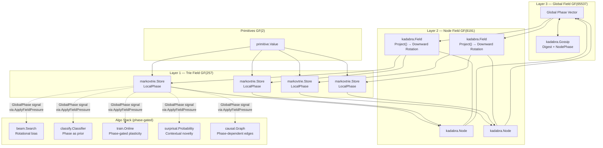

# Six

> This is a research project under active development. 
> Certain code architectural decisions are built for speed, not for comfort. 
> Proper systems engineering is considered deferred until the architecture stabilizes. 
> Feedback is highly appreciated, ideally focused on the architecture as an alternative research model for machine intelligence.

This research project started from a simple question: "Can we reject gradient descent and back-propagation long enough to convince ourselves that we may not need them?"

---

## Architecture

Six has four layers. Each is useful on its own, but the interesting behavior emerges from their interaction.


```mermaid
flowchart TD

    subgraph "Layer 3 — Global Field GF(65537)"
        GF["Global Phase Vector"]
        Gossip["kadabra.Gossip<br/>Digest + NodePhase"]
        GF <--> Gossip
    end

    subgraph "Layer 2 — Node Field GF(8191)"
        N1["kadabra.Node"]
        N2["kadabra.Node"]
        F1["kadabra.Field<br/>Project() → Downward Rotation"]
        F2["kadabra.Field<br/>Project() → Downward Rotation"]
        N1 --- F1
        N2 --- F2
    end

    subgraph "Layer 1 — Trie Field GF(257)"
        S1["markovtrie.Store<br/>LocalPhase"]
        S2["markovtrie.Store<br/>LocalPhase"]
        S3["markovtrie.Store<br/>LocalPhase"]
        S4["markovtrie.Store<br/>LocalPhase"]
    end

    subgraph "Algo Stack (phase-gated)"
        Beam["beam.Search<br/>Rotational bias"]
        Classify["classify.Classifier<br/>Phase as prior"]
        Train["train.Online<br/>Phase-gated plasticity"]
        Surprisal["surprisal.Probability<br/>Contextual novelty"]
        Causal["causal.Graph<br/>Phase-dependent edges"]
    end

    subgraph "Primitives GF(2)"
        V["primitive.Value"]
    end

    %% Bottom-up
    V --> S1
    V --> S2
    V --> S3
    V --> S4
    S1 --> N1
    S2 --> N1
    S3 --> N2
    S4 --> N2
    N1 --> GF
    N2 --> GF

    %% Top-down
    GF --> F1
    GF --> F2
    F1 --> S1
    F1 --> S2
    F2 --> S3
    F2 --> S4

    %% Algo stack receives phase via ApplyFieldPressure
    S1 -. "GlobalPhase signal<br/>via ApplyFieldPressure" .-> Beam
    S1 -. "GlobalPhase signal<br/>via ApplyFieldPressure" .-> Classify
    S1 -. "GlobalPhase signal<br/>via ApplyFieldPressure" .-> Train
    S1 -. "GlobalPhase signal<br/>via ApplyFieldPressure" .-> Surprisal
    S1 -. "GlobalPhase signal<br/>via ApplyFieldPressure" .-> Causal
```

```text
┌────────────────────────────────┐
│           The Field            │
│  Emergent eigenmodes project   │
│  top-down pressure onto tries  │
└──────────────┬─────────────────┘
               │ bias
┌──────────────▼─────────────────┐
│         Kadabra DHT            │
│  Affinity-routed mesh of tries │
│  Gossip propagates field state │
└──────────────┬─────────────────┘
               │ store / retrieve
┌──────────────▼────────────────┐
│          MarkovTrie           │
│  Adaptive probabilistic trie  │
│  Classification + generation  │
└──────────────┬────────────────┘
               │ data
┌──────────────▼────────────────┐
│           Values              │
│  1KB programmable tokens      │
│                               │
└───────────────────────────────┘
```

### Holographic Field Dynamics

The current field path now carries a finite-field phase hierarchy alongside the existing adaptive signals:

| Layer        | Field       | Phase state                                            |
|--------------|-------------|--------------------------------------------------------|
| MarkovTrie   | `GF(257)`   | Trie-local byte-phase signature                        |
| Kadabra Node | `GF(8191)`  | Regional chord aggregated from active tries            |
| Mesh Field   | `GF(65537)` | Global eigenphase aggregated from gossiped node phases |

Instead of treating attention as an explicit weight matrix, Six can now project a dominant global phase back down the stack. Tries rotate their local phase toward the field, beam search boosts continuations that constructively interfere with that phase, and online learning gates plasticity when incoming context is out of phase with the current mesh-wide mode.

## Values: Programmable Data

The `Value` type comes from the idea that machine intelligence currently lacks its own distinct "language" and that, to me at least, it seems like a missed opportunity when we force machines to reason using human language. I believe that severely constrains a system, locking it in human-level semantics.

A Value is a `[128]uint64` — exactly 1KB — that serves simultaneously as data, program, and identity. It is the atom of computation in Six.

```text
┌─────────────┬────────────┬────────────┬────────────┬──────────────┬────────────┬─────────────┬──────┬──────┬─────┬──────────────┐
│   Tokens    │  Program   │  Signals   │  Context   │   Gradient   │    Meta    │ Reserved/K  │ Prev │ Next │ ID  │   Affinity   │
│  1024 bits  │  512 bits  │  512 bits  │  512 bits  │   512 bits   │  512 bits  │  4096 bits  │  64  │  64  │ 64  │   257 bits   │
│ words 0-15  │ words16-23 │ words24-31 │ words32-39 │  words40-47  │ words48-55 │ words56-119 │ 120  │ 121  │ 122 │ words123-127 │
└─────────────┴────────────┴────────────┴────────────┴──────────────┴────────────┴─────────────┴──────┴──────┴─────┴──────────────┘
```

- **Token region**: Raw input data, packed into 16-bit Morton slots. Each slot couples the payload byte with a geometry-derived position code, so the same substrate can ingest any source that can be projected onto an N-dimensional lattice.
- **Affinity region**: A 257-bit locality-sensitive hash (5 independent SimHash projections, with the final word masked to one bit) that fingerprints the content. This determines where the Value lives in the network.
- **Program region**: 32-bit instruction slots that execute on the Value's own bits. When Values encounter each other, their programs run — no external interpreter needed.
- **Context / Gradient / Signals**: 64-byte execution lanes. Boolean code treats them as words; geometric code treats them as 8-lane PGA multivectors.
- **Prev/Next**: Linked-list pointers for chaining Values into sequences and graphs.
- **ID**: 64-bit unique identifier.

### The ALU

The Boolean ALU path is a linear sweep across the `Program` region, where the data in the `Token` region is split up, and then used to perform bitwise operations between two spans. Important to understand is that `Values` are not mutated during this process, the operations are done on copies of the data, and purely emit a `Signal` as the result of each operation, which is written to the `Signals` region.

Because alignment is important in this process the `Program` region is sized for 32 packed instruction slots over the fixed token slab. The `A` span of token data can be held steady while the `B` span is rotated, and the "line number" of the `Program` acts as the local program counter. Rotations happen in steps of 8 positions at a time, matching byte-level granularity.

Once the `Value` comes out of the `ALU` those `Signals` are used to emit new `Values` which are linked via the `PrevID`, `NextID`, and `ValueID` regions.

The linear sweep is a deliberate limitation over loops and branching, as it is sympathetic to the hardware, eliminating thread divergence on the GPU and enabling parallelism via SIMD on the CPU.

To recover the ability for loops and branching, a final instruction can be written (need to take some of the reserved region) to mark a `Value` for a loop (re)cycle, or branch traversal. When the `Value` comes out of the `ALU` and is marked as such, it is then (re)placed onto a priority `Queue` in the orchestrator and fed back into the `ALU` for another run.

### Geometric ALU

The Boolean ALU keeps the low 4-bit truth-table opcodes exactly as-is. The high nibble now has a Projective Geometric Algebra lane for 64-byte multivectors:

| Opcode | Operation | Frame contract                            |
|--------|-----------|-------------------------------------------|
| `0x10` | Compose   | `Signals = Context · Gradient`            |
| `0x20` | Sandwich  | `Signals = Context · Gradient · Context†` |
| `0x30` | Reverse   | `Signals = Context†`                      |

`Context`, `Gradient`, and `Signals` are each 512-bit regions, so each holds one `pkg/core/numeric/geometry.Multivector` without changing the 1024-byte `Value` stride. The kernel dispatch preserves the full opcode byte before falling back to the Boolean low nibble, so geometric opcodes cannot collapse to `FALSE`. CPU, Metal, and CUDA now all expose the same PGA lane; the native kernels read the high nibble in-band and write their 8-lane result back into `Signals`. CPU uses hand-written ARM64 and AMD64 assembly for the PGA product, CUDA executes the lane as native `float64`, and Metal preserves the 64-bit frame ABI while converting to native `float32` arithmetic at the GPU boundary because Apple Metal does not expose double precision in shader code.

Each newly minted `Value` derives a stable `primitive.FrameMultivector` from its payload and writes it into `Context`. Boolean code can still inspect the same lanes through `ContextVector`, but the geometric path treats the region as a continuous coordinate. The programmer layer can now emit first-class `GeometricIntent` operands, so a `Value` can carry its rotor and target into the compute substrate instead of relying on an external interpreter.

### Signals

When two Values are paired, their token regions are compared using bitwise operations. The results are never written back. They are treated purely as **signal**. The signal dictates which new Values get emitted.

Two operations produce two kinds of signal:

**Cancel (XOR → longest zero-run)**

XOR produces zeros wherever two Values encode the same information. The longest contiguous zero-run reveals the largest shared component.

Given three sentences encoded as Values:

```
Value A:  [Sandra] [is in the] [Garden]
Value B:  [Roy]    [is in the] [Kitchen]
Value C:  [Harold] [is in the] [Kitchen]
```

When Value A is paired with Value B, the XOR of their token regions produces zeros across the bit-span where `is in the` is encoded, because that substring is identical in both. Shorter zero-runs also appear for any incidentally shared bits, but the **longest run wins** and becomes the decisive signal.

The cancel signal emits three new Values:

- `{is in the}` — the shared component, extracted as a structural label
- `[Sandra]` — left residue, linked forward through the label
- `[Roy]` — right residue, linked forward through the label

Repeating this across all pairs builds a graph (using PrevID, and NextID, based on ValueID, this should be by emitting new Values, not by mutating existing ones):

```
{is in the}   -points to→ [Sandra, Roy, Harold]
[Sandra]      -points to→ [Garden]
[Roy, Harold] -points to→ [Kitchen]
[Kitchen]     -points to→ [Roy, Harold]
```

This structure can now answer queries through the same mechanism. The prompt `"Where is Roy?"` cancels `{is}` against the existing `{is in the}` label, which points to `[Sandra, Roy, Harold]`. Then `[Roy]` cancels against that set, resolving to `[Kitchen]`.

**Merge (AND → longest one-run)**

AND produces ones only where both Values agree. The longest contiguous one-run reveals a convergence point, where two Values share dense overlapping structure. Merge emits Values that consolidate the shared region, linking the sources through it.

In the example above, when `[Roy]{is in the}[Kitchen]` is paired with `[Harold]{is in the}[Kitchen]`, the `AND` of their token regions produces a long one-run across `[Kitchen]`, because both Values agree densely there. The merge signal consolidates them: `[Kitchen]` becomes a single node pointing back to both `[Roy]` and `[Harold]`.

**The longest sequential run is always the decisive signal.** Both operations produce multiple runs of varying lengths. `ScanSignals` detects all of them, sorts by length, and the longest of each kind becomes the local action. Shorter signals are published for inter-cluster exchange.

## MarkovTrie: Learning Without Gradients

This component quite naturally and very quickly spun out of control. It started at a way to store `Values`.

MarkovTrie is a suffix trie that learns from every observation. No training epochs, no loss functions, no weight matrices. It sees data, it updates.

**Core loop:**

1. **Tokenize** input (character-level, word-level, or BPE).
2. **Walk** the trie, recording which paths exist and which don't.
3. **Compute surprisal** — how unexpected this input is given what the trie already knows.
4. **Learn** by inserting the sequence into the trie with a learning rate modulated by surprisal. Novel inputs are learned aggressively; familiar inputs reinforce gently.
5. **Decay** all counts by a factor per step, so stale knowledge fades and the trie tracks the current distribution.
6. **Prune** dead branches when their counts fall below threshold.

**Classification** uses Naive Bayes over interpolated n-gram probabilities. The trie maintains per-label counts at every node, and classification is a walk through the trie accumulating log-evidence per label.

**Generation** uses beam search with temperature-controlled sampling. The beam width, temperature, and generation length are not hyperparameters — they are derived from the trie's own adaptive state.

Each trie edge also carries a transition motor derived from the parent and child `Context` multivectors. Continuation rescoring keeps the GF(257) phase interference pass as the fast Boolean filter, then adds a PGA pass that composes a candidate motor and boosts continuations that steer the current context toward the local attractor.

**Adaptive self-tuning** replaces every fixed constant with an online estimator:

| Parameter              | Signal                    | Mechanism                                              |
|------------------------|---------------------------|--------------------------------------------------------|
| Decay factor           | Surprisal EMA             | High surprisal = volatile domain = faster decay        |
| Learning rate          | Per-token surprisal       | Novel tokens learned more aggressively                 |
| Prune threshold        | Node growth rate          | Fast growth = prune harder to control memory           |
| Classification context | Classification entropy    | Confused classifier = widen context window             |
| Temperature            | Surprisal EMA             | Familiar domain = explore more; novel domain = exploit |
| Beam width             | Classification confidence | Low confidence = wider search                          |
| Interpolation weights  | Depth hit rate            | Tracks which n-gram depths are most predictive         |
| Episodic blend         | Episodic match quality    | Useful episodic memory = higher blend weight           |
| Unsupervised threshold | Classification accuracy   | Maturing label space = require more confidence         |

The unified entry point is `Predict(data) -> Prediction` — the caller passes data, the system returns a classification and continuations. Everything else is internal.

Internally, each layer talks through the same `algo.Prediction` envelope and `algo.Stack` orchestration object, so trie-local inference, node-level composition, and field feedback all reuse one interface instead of accumulating layer-specific management code.

For control, a multimodal coordinator can bind sensory, action, and reward tries while maintaining coactivation-weighted expected reward for each observed `(sensory, action, reward)` triplet. Reward stays the terminal variable; causal regime labels describe the environment where the transition should remain stable, such as field phase, sensory cluster, source, or intervention family. The causal graph tracks `sensory -> action -> reward` path reliability from regime invariance and support, penalizes paths with high reward-affinity residual drift, and policy projection biases action ranking toward the strongest bottleneck edge before projecting ranked continuations upward through the same prediction envelope.

The coordinator also builds an immutable Orthogonal Procrustes alignment from coactivated sensory and action multivectors. Exact sensory matches still dominate, but an unseen sensory `Value` can be projected into the action manifold and scored by nearest aligned action geometry. This gives the policy path a mathematical zero-shot bridge without abandoning the affinity filter.

Episodic memory stores one geometry vector per event. `Buffer.Realign` lets an idle consolidation loop resolve old events against current trie coordinates, run Procrustes, and rotate the whole ring buffer in place so older memories remain coherent as the manifold drifts.

### Kadabra: Distributed Knowledge Routing

Kadabra is a Kademlia-style distributed hash table where the nodes are MarkovTries. It serves two purposes: **distributing knowledge** across tries based on content similarity, and **forming the substrate** from which the field emerges.

**Affinity-based routing**: When a Value is published, its 257-bit affinity fingerprint determines which trie stores it. Values with similar content cluster on the same node. This is not a design choice imposed from outside — it follows from the LSH property: similar inputs produce similar hashes, so they route to the same place. Each trie naturally specializes in a region of content space.

**Replication**: Each Value is stored on the `k` closest nodes by affinity distance (Hamming distance over the 257-bit affinity vectors). This provides both redundancy and the ability for multiple tries to learn from the same data.

**Adaptive peer selection**: Each routing bucket tracks peer quality over epochs. Every `EpochQueries` queries, the bucket scores its peers by latency, explores alternatives, and swaps in better candidates. This is the Kadabra algorithm — a multi-armed bandit at the routing layer.

**Zero-affinity rejection**: Values without a computed affinity fingerprint are invalid and rejected. Every Value must know what it is before entering the network.

### The Field: Emergent Attention

The field is the mechanism that binds isolated tries into a coherent system. It is not a data structure that nodes query — it is a force that acts on them.

**Gossip protocol**: At each epoch boundary, every node broadcasts a compact `FieldDigest` — its current surprisal, classification entropy, growth rate, node phase, and 257-bit affinity vector — to all routing peers. Propagation is automatic.

**Eigenmode detection**: When a node absorbs a digest, the field recomputes emergent eigenmodes — clusters of structurally aligned tries. Structural alignment is measured by Jaccard coupling over the 257-bit affinity vectors, with the coupling threshold learned from the observed pairwise distribution. Phase coherence is measured by **surprisal velocity** during pressure projection — whether nodes are rising or falling in surprisal together.

**Top-down projection**: The dominant eigenmode — the cluster with the most collective energy — is what the system is "attending to" right now. The field projects asymmetric pressure onto each trie:

|              | Aligned (in dominant mode)               | Misaligned (outside dominant mode)         |
|--------------|------------------------------------------|--------------------------------------------|
| **Decay**    | Suppressed — knowledge retained longer   | Amplified — stale knowledge pruned faster  |
| **Learning** | Amplified — absorbs related input faster | Suppressed — doesn't waste effort on noise |

This is attention without an attention mechanism. No query-key-value matrices, no softmax — the field *is* the attention. Tries don't decide to check the field. The field decides which tries matter and modulates their behavior accordingly, exactly as a physical field acts on particles within it.

**Phase dynamics**: In-phase nodes (both absorbing novelty or both consolidating) amplify each other's field pressure. Anti-phase nodes (one learning while the other is stable) dampen each other — they're already complementing each other naturally, so the field doesn't interfere.

---

## Compute Substrate

Values execute their programs on a multi-substrate backend that automatically selects the best available hardware:

1. **CPU**: Universal bitwise executor with SIMD affinity distance kernels and hand-written ARM64/AMD64 assembly for the PGA product. Supports all 16 boolean truth-table operations plus geometric `Compose`, `Sandwich`, and `Reverse`.

2. **Apple Metal**: GPU compute shaders for macOS. Compiled from Metal Shading Language at build time. The geometric lane preserves the 64-bit frame ABI and uses native `float32` arithmetic in the shader.

3. **NVIDIA CUDA**: GPU kernels for NVIDIA hardware. Generated via cgo bindings. The geometric lane uses native `float64`.

The `compute.Backend` load-balancer probes available substrates at startup and routes work to whichever has the least in-flight depth and lowest exponential moving average service time. When all accelerators are saturated, work overflows to CPU.

---

## Network Transport

Six provides pluggable transport for distributing Values across machines:

- **QUIC**: Reliable, encrypted WAN transport with congestion control. Single bidirectional stream per connection carrying Value frames. Built on `golang.org/x/net/quic`.
- **UDP**: Lightweight datagram transport for local-network gossip.
- **IPC**: Inter-process communication for co-located nodes.

Each transport implements `io.ReadWriteCloser` and carries Values as opaque 1KB frames.

---

## Configuration

Six is configured via YAML (default: `cmd/cfg/config.yml`, overridable via `$HOME/.six/config.yml`):

```yaml
system:
  batchSize: 10000
  batchWindow: 500        # microseconds
  queueSize: 20000

value:
  words: 128
  bytes: 1024
  region:
    tokens:   { start: 0,   bits: 1024 }
    program:  { start: 16,  bits: 512 }
    signals:  { start: 24,  bits: 512 }
    context:  { start: 32,  bits: 512 }
    gradient: { start: 40,  bits: 512 }
    meta:     { start: 48,  bits: 512 }
    prev:     { start: 120, bits: 64 }
    next:     { start: 121, bits: 64 }
    id:       { start: 122, bits: 64 }
    affinity: { start: 123, bits: 257 }

kadabra:
  bits: 64
  bucketSize: 20
  replicationFactor: 3
  alpha: 3
  epochQueries: 100
```

Firmware programs (LGP assembly for Value program regions) are also defined in config, enabling runtime-configurable computation without recompilation.

---

## Infrastructure

The project includes a Docker Compose stack for observability and data management:

| Service                          | Purpose                               | Port       |
|----------------------------------|---------------------------------------|------------|
| Elasticsearch (3-node cluster)   | Log aggregation, experiment telemetry | 9200       |
| Elasticsearch ML nodes (3 nodes) | Machine-learning-capable ES nodes     | —          |
| Kibana                           | Log visualization and dashboards      | 5601       |
| MinIO                            | S3-compatible object storage          | 9000, 9001 |
| LakeFS                           | Data versioning over MinIO            | 8000       |

Structured logs are shipped to Elasticsearch via a bulk indexer with configurable flush intervals. Trace-level logging operates independently of the global log level, allowing production systems to emit detailed traces without noise in standard output.

---

## Building

```bash
# Full build (generates primitives, compiles Metal shader, generates CUDA bindings)
make build

# Run tests (linker flag required: pool uses go:linkname into runtime)
make test
# or: go test -ldflags='-checklinkname=0' ./...

# Generate experiment paper
make paper
# The pipeline emits current experiment results; gate pass/fail is stored in
# the result snapshots so paper generation is not blocked by research baselines.

# CPU profile an experiment
make pprof EXP=Text_Classification
```

**Requirements**: Go 1.26+. Metal shader compilation requires macOS with Xcode. CUDA requires NVIDIA toolkit. Both are optional — the CPU backend is always available.

---

## Usage

```go
// Create a Kadabra node backed by a MarkovTrie
node := kadabra.NewKadabraNode(
    kadabra.NodeIDFromString("node-alpha"),
    kadabra.WithReplicationFactor(3),
)

// Create a Value (affinity + ID filled by NewValue), publish to the DHT
value, _ := primitive.NewValue([]byte("the cat sat on the mat"))
node.Publish(*value, "Sentence")
value.Close()

// The trie learns automatically. Query it:
prediction := node.Store.Predict("the cat sat")
fmt.Println(prediction.Label)         // "Sentence"
fmt.Println(prediction.Continuations) // [{Sequence: "on the mat" Score: 0.87} ...]
```

For distributed operation, connect nodes and let the field emerge:

```go
nodes := make([]*kadabra.KadabraNode, 10)
for i := range nodes {
    nodes[i] = kadabra.NewKadabraNode(kadabra.NodeID(i))
}

// Connect the mesh
for i := range nodes {
    for j := i + 1; j < len(nodes); j++ {
        kadabra.Connect(nodes[i], nodes[j], 1.0)
    }
}

// Publish data — Values route to affinity-similar tries automatically.
// The field emerges from gossip and biases learning across the network.
// No central coordinator. No global optimizer. Just local learning
// shaped by emergent collective dynamics.
```

---

## Project Structure

```text
six/
├── cmd/                    # CLI commands (root, init, paper)
│   └── cfg/config.yml      # Default configuration
├── pkg/
│   ├── primitive/           # Value type, VSA operations, affinity LSH
│   ├── compute/             # Multi-substrate load balancer
│   │   └── kernel/
│   │       ├── cpu/         # SIMD-optimized bitwise executor
│   │       ├── cuda/        # NVIDIA GPU kernels
│   │       └── metal/       # Apple Metal GPU shaders
│   ├── store/
│   │   ├── markovtrie/     # Adaptive probabilistic trie
│   │   └── kadabra/         # Kademlia DHT + field dynamics
│   ├── network/             # QUIC, UDP, IPC transports
│   ├── vm/                  # Machine orchestrator
│   ├── core/                # Configuration management
│   └── errnie/              # Structured logging + Elasticsearch
├── docker-compose.yml       # Elasticsearch, Kibana, MinIO, LakeFS
├── Makefile                 # Build targets
└── main.go                  # Entry point
```

---

## Status

Six is research software under active development. The core mechanisms work and are tested, but the system is not yet production-ready. Current focus areas:

- Field dynamics and eigenmode-driven attention
- Multi-node distributed learning across network boundaries
- GPU acceleration of Value program execution at scale
- Episodic memory integration with field pressure

---

## License

See repository for license details.
