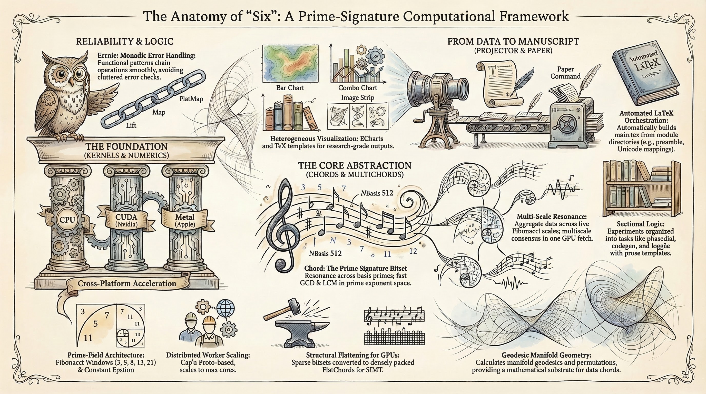

<p align="center">
  
</p>

<h1 align="center">six</h1>

<p align="center">
  <strong>Physics-Sympathetic, Algebraic Computing Substrate</strong>
</p>

---

> [!NOTE]
> This is a research project under active development.
> This README is a condensed view grounded in the current codebase.

---

## Core Thesis

> **Can we reject gradient descent and backpropagation long enough to convince ourselves that we may not need them?**

Six is a radical departure from traditional Von Neumann architectures and heavyweight network overlays. We are eliminating state orchestrators, distributed hash tables (DHTs), consensus-heavy coordination layers, and legacy control flow patterns. Instead, Six is built fundamentally as a **physics-sympathetic, algebraically routed, execution-in-data computing substrate**. 

By composing Unix-like `io.Reader` and `io.Writer` pipelines down to the foundational byte structures, network distribution and in-memory execution unify perfectly without "split-brain" state caching.

---

## Organization

Given this is a research project, there are certain additional tools that are included that have no direct bearing on the core substrate. If you understand Go's packaging system, it should be obvious how to pull out the standalone engine.

```go
go get -u github.com/theapemachine/six/pkg/primitive
```

The tooling remains in place for reproducibility.

---

## Architectural Pillars

### 1. `Value`: The Self-Executing Data Plane (Virtual Machine)
Traditional software separates data objects from the logic that modifies them. In Six, data and execution are mathematically fused. A `Value` is a contiguous, hardware-aligned 1024-byte (128-word) topological frame holding:
- **Data Limits**: Pure memory tokens.
- **Topological Links**: Mathematical identity pointers to preceding and succeeding frame IDs.
- **Affinity Masks**: Hardware alignment flags defining compatibility matches.
- **Embedded VM Program**: An 8-instruction, 32-bit Virtual Machine bytecode array defining how this specific `Value` interacts with others on the network.

**Values process themselves.** When a Value requires search, graph healing, or matching, it natively installs an embedded Tombstone query (using mathematical logic like `OpMatchZero` or `OpXor`). Go-level orchestration is minimized; data behavior is entirely governed by its embedded payload traversing the computational execution logic.

### 2. `Region`: Affine Gossip Routing over GF(65537)
Instead of traditional network routing tables or diffusion models which flood graphs and create bottlenecks, Six handles topology using geometry. 

A `Region` doesn’t "store" Values. It's not a container; **it's a mixer.** 

A Region implements `io.ReadWriteCloser`. As a `Value` streams horizontally through the region's `io.Writer` pipeline, the Region applies a bijection—an affine transform over **GF(65537)** (the 4th Fermat prime). This $O(1)$ multiplication mathematically remaps the Value's telemetry signature, teleporting it algebraically across the search space.
- **Inbound Mixing**: $y = (a \cdot x + b) \pmod{65537}$. Mathematical dispersion without data loss.
- **Algebraic Search Convergence**: Because GF(65537) is closed, a query traversing the hierarchy simply inverts the local transform recursively ($a^{-1} \cdot (y-b)$). This collapses complex graph searches down to static algebra. 

Because the entire mesh layer relies purely on primitive recursive `io.Writer` pipelines, **Regions within Regions** compose seamlessly, creating multi-scale, hierarchical topological search without implementing complex messaging protocols. The `Value` holds the spatial depth TTL; the system handles the distribution automatically.

### 3. `Backend`: Universal Bitwise Execution 
When a programmed `Value` or experimental Query traverses the mesh, it runs on the CPU physical ALU engine. The backend takes resident memory arrays and meshes incoming programs together. It executes Universal Boolean gates to slice and combine 1024-bit arrays strictly mathematically. 

Network control packages (like "Tombstones") are trapped seamlessly into a Region's internal `inbox` queue when detected mid-pipe. The local physical CPU `Backend` consumes the Region like any other `io.Reader`, dynamically ingesting queries and naturally acting on the local data before dropping the results out the other end.

---

## How it Fits Together

The pipeline is perfectly decoupled via unix composition:

1. **Ingress**: `io.Copy(myRegion, udpSocket)`  
   Inbound packets stream into the affine topology layer. The stream magically stirs payloads, updating their topological hashes natively inline.
   
2. **Topological Sub-Routing**: `io.Copy(subRegion, myRegion)`  
   `Region` objects map to one another through simple `io.Writer` arrays. Multi-scale search cascades natively downward.

3. **Execution**: `io.Copy(cpuBackend, myRegion)`  
   When the topology detects `Values` programmed for search/healing, it dynamically routes them through the `inbox`. The `cpu.Backend` acts as a physical engine seamlessly drawing and executing the queries locally.

Zero serialization overhead. Zero messaging protocols. Pure native algorithmic physics.
