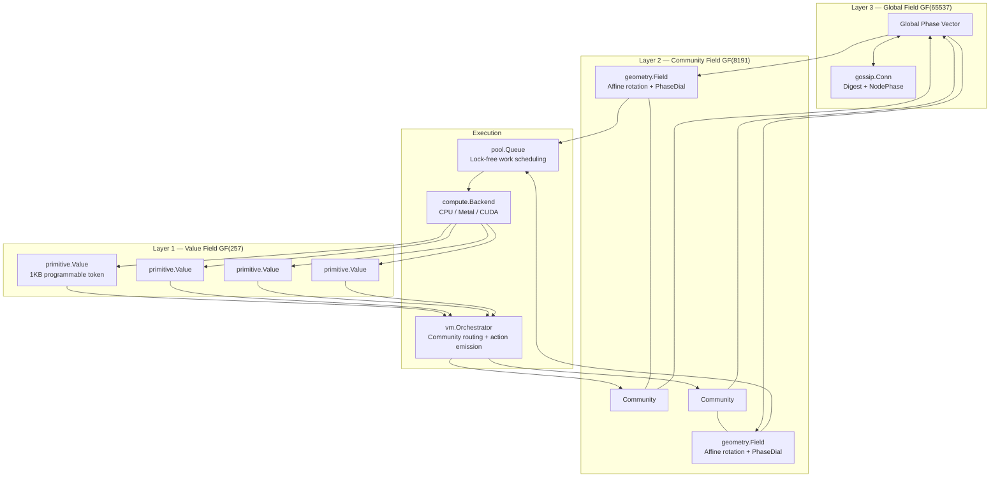

# Six

> This is a research project under active development. 
> Certain code architectural decisions are built for speed, not for comfort. 
> Proper systems engineering is considered deferred until the architecture stabilizes. 
> Feedback is highly appreciated, ideally focused on the architecture as an alternative research model for machine intelligence.

This research project started from a simple question: "Can we reject gradient descent and back-propagation long enough to convince ourselves that we may not need them?"

---

## Architecture

Six has three active layers. Values are the atoms of computation. The Queue and Backend execute their programs. The Orchestrator groups settled Values into communities and uses the Field to drive further computation.


```mermaid
flowchart TD

    subgraph "Layer 3 — Global Field GF(65537)"
        GF["Global Phase Vector"]
        Gossip["gossip.Conn<br/>Digest + NodePhase"]
        GF <--> Gossip
    end

    subgraph "Layer 2 — Community Field GF(8191)"
        C1["Community"]
        C2["Community"]
        F1["geometry.Field<br/>Affine rotation + PhaseDial"]
        F2["geometry.Field<br/>Affine rotation + PhaseDial"]
        C1 --- F1
        C2 --- F2
    end

    subgraph "Layer 1 — Value Field GF(257)"
        V1["primitive.Value<br/>1KB programmable token"]
        V2["primitive.Value"]
        V3["primitive.Value"]
        V4["primitive.Value"]
    end

    subgraph "Execution"
        Q["pool.Queue<br/>Lock-free work scheduling"]
        B["compute.Backend<br/>CPU / Metal / CUDA"]
        O["vm.Orchestrator<br/>Community routing + action emission"]
    end

    %% Bottom-up: Values settle, orchestrator groups them
    V1 --> O
    V2 --> O
    V3 --> O
    V4 --> O
    O --> C1
    O --> C2
    C1 --> GF
    C2 --> GF

    %% Top-down: field pressure drives new computation
    GF --> F1
    GF --> F2
    F1 --> Q
    F2 --> Q
    Q --> B
    B --> V1
    B --> V2
    B --> V3
    B --> V4
```

```text
┌──────────────────────────────────┐
│       Global Field GF(65537)     │
│  Aggregates community fields     │
│  Gossip propagates phase state   │
└──────────────┬───────────────────┘
               │ top-down pressure
┌──────────────▼───────────────────┐
│     Community Fields GF(8191)    │
│  Orchestrator groups Values by   │
│  affinity into communities       │
└──────────────┬───────────────────┘
               │ action emission
┌──────────────▼───────────────────┐
│    Queue + Compute Backend       │
│  Lock-free pool, multi-substrate │
│  CPU / Metal / CUDA execution    │
└──────────────┬───────────────────┘
               │ programs run on
┌──────────────▼───────────────────┐
│           Values GF(257)         │
│  1KB programmable tokens         │
│  Linked via PrevID / NextID      │
└──────────────────────────────────┘
```

### Field Hierarchy

The three finite fields form a phase hierarchy. Each layer aggregates the one below it; gossip carries the vectors peers need to reconstruct the same pressure field.

| Layer           | Field       | Phase state                                                  |
|-----------------|-------------|--------------------------------------------------------------|
| Value           | `GF(257)`   | Per-Value byte-phase, local interference, affine rotation    |
| Community Field | `GF(8191)`  | Regional aggregate from community members                    |
| Global Field    | `GF(65537)` | Global eigenphase aggregated across nodes via gossip digests |

### Data Flow

This is the actual end-to-end path the code implements today:

1. **Byte stream arrives** — `vm.Machine.Load` feeds a `data.Provider` into a `transport.Pipeline`.
2. **Tokenizer chunks** — `vm.Tokenizer` reads from a ring buffer, calls `primitive.NewValue` to mint one or more `Value` segments per chunk. Payload bytes are Morton-coded into 16-bit slot pairs in the token region.
3. **Segments are linked** — Multi-segment Values are chained via `PrevID` / `NextID`. The tokenizer also links successive chunks: the previous tail's `NextID` points to the new head, and the new head's `PrevID` points back.
4. **Program installed** — `programmer.Installer` writes the `"affinity"` program into each Value's program region. This is a compiled frame, not raw words.
5. **Published to Queue + Orchestrator** — Each minted Value is published to the `pool.Queue` (for backend execution) and the `vm.Orchestrator` (for community routing).
6. **Backend executes** — `compute.Backend` dispatches the Value's program to CPU, Metal, or CUDA. The ALU runs the program region against the token region and writes results to signals/context/gradient.
7. **Queue cascades** — If word 117 (`SchedulingNextProgramWord`) is non-zero after execution, the Queue re-publishes the referenced Value for another pass. `next self` makes a Value loop.
8. **Orchestrator groups** — When a Value settles (word 117 = 0), the Orchestrator's `Cycle` picks it up. `findCommunity` computes Hamming distance over the 5 affinity words against existing community fields. Close enough → join; too far or all saturated → spawn a new `GF(8191)` community in the first empty slot.
9. **Community emits actions** — When a community has ≥ 3 members and its dominant mode's concentration exceeds the resonance threshold, `emitActions` mints a new Value from the community's aggregate state, installs a program (`beam_swarm_step` or `active_inference`), and publishes it back to the Queue. The community's Value list is then cleared.

For prompts, `Machine.Prompt` takes the same path but uses `PublishTracked` and spins until the Value's scheduling word clears.

## Values: Programmable Data

The `Value` type comes from the idea that machine intelligence currently lacks its own distinct "language" and that, to me at least, it seems like a missed opportunity when we force machines to reason using human language. I believe that severely constrains a system, locking it in human-level semantics.

A Value is a `[128]uint64` — exactly 1KB — that serves simultaneously as data, program, and identity. It is the atom of computation in Six.

```text
┌─────────────┬────────────┬────────────┬────────────┬──────────────┬──────────────┬─────────────┬──────┬──────┬─────┬──────────────┐
│   Tokens    │  Program   │  Signals   │  Context   │   Gradient   │  Properties  │ Reserved/K  │ Prev │ Next │ ID  │   Affinity   │
│  1024 bits  │  512 bits  │  512 bits  │  512 bits  │   512 bits   │   512 bits   │  4096 bits  │  64  │  64  │ 64  │   257 bits   │
│ words 0-15  │ words16-23 │ words24-31 │ words32-39 │  words40-47  │  words48-55  │ words56-119 │ 120  │ 121  │ 122 │ words123-127 │
└─────────────┴────────────┴────────────┴────────────┴──────────────┴──────────────┴─────────────┴──────┴──────┴─────┴──────────────┘
```

- **Token region**: Raw input data, packed into 16-bit Morton slots. Each slot couples the payload byte with a geometry-derived position code, so the same substrate can ingest any source that can be projected onto an N-dimensional lattice.
- **Affinity region**: A 257-bit locality-sensitive hash (5 independent SimHash projections, with the final word masked to one bit) that fingerprints the content. This determines which community the Value joins.
- **Program region**: Packed bits the compute kernels interpret (e.g. universal bitwise sweep with per-rotation opcodes in the program words). **Authoring** does not hand-edit raw words: you write lines of source (see below), the programmer **`Compiler`** fills this region from a compiled **`Frame`**. When Values encounter each other, their programs run — no external interpreter needed.
- **Properties region** (words 48–55): 512-bit **canonical property band** — discrete tags, forward-transition statistics, and related state (for example eigenmode / Markov phases over property symbols). Legacy uses (TTL, noise, probe ABI) may still occupy fixed words inside this span until callers migrate.
- **Context / Gradient / Signals**: 64-byte execution lanes. Boolean code treats them as words; geometric code treats them as 8-lane PGA multivectors.
- **Prev/Next**: Linked-list pointers for chaining **segments** of a multi-segment Value (long payloads) and for maintaining sequence order across tokenizer chunks. Values always know their original ordering.
- **ID**: 64-bit unique identifier, assigned by atomic counter at mint time.
- **Word 117** (`SchedulerNextProgramWord`): scheduler next program — `pkg/compute/programmer` and **`Executable.Execute`** write the **ValueID** that should run **after** this frame completes. Zero means settled. `next self` means re-enter the Queue for another ALU pass.

### Properties

Canonical 512 bit region, spanning words 48 to 55.

- WORD 0: **labels** (4 packed)
- WORD 1: **confidence**
- WORD 2: **epoch**
- WORD 3: **role + programID**
- WORD 4: **state** (IDLE, READY, BUSY, WAITING, DONE)
- WORD 5: **temperature**
- WORD 6: **prediction** expected dominant lane next Value, computed from eigenmode trajectory, XOR predicted vs actual = surprisal score
- WORD 7: **prediction error** accumulated delta between predictions and outcomes (potentially: high error, raise temperature?)

### Program Authoring (`pkg/compute/programmer`)

Named programs live in **`cmd/cfg/config.yml`** under **`programs:`** as multi-line strings. At runtime, `core.Cfg.Programs` exposes that text; **`NewProgram(nameOrSource)`** resolves a string against that map when the key exists, otherwise treats the string as full source.

Pipeline in order:

1. **`Program.Load()`** — splits non-blank lines and **`strings.Fields`** each line into columns.
2. **`Parser.Parse()`** — returns **`([]Token, *Continuation, error)`**. Operation lines use five fields: **`srcA` `srcB` `dst` `op` `mode`** (region refs like `tokens[0,2]`, `affinity[0]`, `signals[0]`; ops such as `xor`, `popcount`, `and`, `or`; modes `accumulate` or `reduce`). Optionally, **after all op lines**, a single trailing directive may name the **next program by ValueID**: **`next <uint64>`** or **`next self`** (self = reschedule this Value's own ID — recursion / re-entry).
3. **`NewCompiler(tokens, WithContinuation(cont))`** — holds tokens and the optional continuation; **`Compile(CompilerTarget)`** dispatches to CPU / Metal / CUDA lowering and returns **`[]Frame`**. Each **`Frame`** carries a **`Program [64]uint64`**; **`Frame.writeIntoProgramRegion`** copies the configured program word span into a **`primitive.Value`**.
4. **`Executable`** — optional **`WithInputs([]*Value)`** copies **`inputs[0]`**'s full wire into each emitted Value before the frame overwrites the program region. After minting one Value per frame, **`Execute`** writes **word 117** on each Value: **non-final Values** in the batch point to the **following emitted Value's ID** (implicit chain across a multi-frame compile); the **final** Value uses the parsed **`next`** line when present (**literal ID** anywhere in the system, **`next self`**, or omit for no trailing hop). An optional **finalizer** can emit follow-on Values; **`Finalize`** runs on one post-execution Value.

So: **one compiled frame → one program region on one Value**; **N frames → N Values**; **chaining** is expressed both **within a batch** (frame *i* → frame *i+1*) and **after the last frame** (arbitrary ValueID, including self).

### The ALU

The Boolean ALU path is a linear sweep across the `Program` region, where the data in the `Token` region is split up, and then used to perform bitwise operations between two spans. Important to understand is that `Values` are not mutated during this process, the operations are done on copies of the data, and purely emit a `Signal` as the result of each operation, which is written to the `Signals` region.

The physical layout in the program words (including packed per-rotation opcodes and the steady **A** vs rotated **B** token spans) is what the CPU / Metal / CUDA kernels consume after authoring has been lowered into those bits. Rotations advance in steps that match the kernel contract (e.g. 8-bit steps for the universal bitwise path). The high-level **source lines** you edit under `programs:` are **not** the same as raw machine words — the compiler bridges them.

The region-program ABI now lowers each five-column source line into a single Value frame descriptor. Program word 16 carries the descriptor marker, ALU op, and mode; program words 17-19 pack `srcA`, `srcB`, and `dst` region references. The ALU executes those references directly against the Value frame: `accumulate` writes bitwise results back into the destination region, while `reduce` writes popcount scalars into destination lanes. Multi-line programs still materialize as chained Values through word 117, so recursion is `next self` rather than a host-side loop.

Once the `Value` comes out of the `ALU` those `Signals` are used to emit new `Values` which are linked via the `PrevID`, `NextID`, and `ValueID` regions.

The linear sweep is a deliberate limitation over loops and branching, as it is sympathetic to the hardware, eliminating thread divergence on the GPU and enabling parallelism via SIMD on the CPU.

To recover the ability for loops and branching, a final instruction can be written (need to take some of the reserved region) to mark a `Value` for a loop (re)cycle, or branch traversal. When the `Value` comes out of the `ALU` and is marked as such, it is then (re)placed onto a priority `Queue` in the orchestrator and fed back into the `ALU` for another run.

### Geometric ALU

The Boolean ALU keeps the low 4-bit truth-table opcodes exactly as-is. The high nibble now has a Projective Geometric Algebra lane for 64-byte multivectors:

| Opcode | Operation | Frame contract                            |
|--------|-----------|-------------------------------------------|
| `0x10` | Compose   | `Signals = Context · Gradient`            |
| `0x20` | Sandwich  | `Signals = Context · Gradient · Context†` |
| `0x30` | Reverse   | `Signals = Context†`                      |

`Context`, `Gradient`, and `Signals` are each 512-bit regions, so each holds one `pkg/core/numeric/geometry.Multivector` without changing the 1024-byte `Value` stride. The kernel dispatch preserves the full opcode byte before falling back to the Boolean low nibble, so geometric opcodes cannot collapse to `FALSE`. CPU, Metal, and CUDA now all expose the same PGA lane; the native kernels read the high nibble in-band and write their 8-lane result back into `Signals`. CPU uses hand-written ARM64 and AMD64 assembly for the PGA product, CUDA executes the lane as native `float64`, and Metal preserves the 64-bit frame ABI while converting to native `float32` arithmetic at the GPU boundary because Apple Metal does not expose double precision in shader code.

Each newly minted `Value` derives a stable `primitive.FrameMultivector` from its payload and writes it into `Context`. Boolean code can still inspect the same lanes through `ContextVector`, but the geometric path treats the region as a continuous coordinate. The programmer layer can now emit first-class `GeometricIntent` operands, so a `Value` can carry its rotor and target into the compute substrate instead of relying on an external interpreter.

### Signals

When two Values are paired, their token regions are compared using bitwise operations. The results are never written back. They are treated purely as **signal**. The signal dictates which new Values get emitted.

Two operations produce two kinds of signal:

**Cancel (XOR → longest zero-run)**

XOR produces zeros wherever two Values encode the same information. The longest contiguous zero-run reveals the largest shared component.

Given three sentences encoded as Values:

```
Value A:  [Sandra] [is in the] [Garden]
Value B:  [Roy]    [is in the] [Kitchen]
Value C:  [Harold] [is in the] [Kitchen]
```

When Value A is paired with Value B, the XOR of their token regions produces zeros across the bit-span where `is in the` is encoded, because that substring is identical in both. Shorter zero-runs also appear for any incidentally shared bits, but the **longest run wins** and becomes the decisive signal.

The cancel signal emits three new Values:

- `{is in the}` — the shared component, extracted as a structural label
- `[Sandra]` — left residue, linked forward through the label
- `[Roy]` — right residue, linked forward through the label

Repeating this across all pairs builds a graph (using PrevID, and NextID, based on ValueID, this should be by emitting new Values, not by mutating existing ones):

```
{is in the}   -points to→ [Sandra, Roy, Harold]
[Sandra]      -points to→ [Garden]
[Roy, Harold] -points to→ [Kitchen]
[Kitchen]     -points to→ [Roy, Harold]
```

This structure can now answer queries through the same mechanism. The prompt `"Where is Roy?"` cancels `{is}` against the existing `{is in the}` label, which points to `[Sandra, Roy, Harold]`. Then `[Roy]` cancels against that set, resolving to `[Kitchen]`.

**Merge (AND → longest one-run)**

AND produces ones only where both Values agree. The longest contiguous one-run reveals a convergence point, where two Values share dense overlapping structure. Merge emits Values that consolidate the shared region, linking the sources through it.

In the example above, when `[Roy]{is in the}[Kitchen]` is paired with `[Harold]{is in the}[Kitchen]`, the `AND` of their token regions produces a long one-run across `[Kitchen]`, because both Values agree densely there. The merge signal consolidates them: `[Kitchen]` becomes a single node pointing back to both `[Roy]` and `[Harold]`.

**The longest sequential run is always the decisive signal.** Both operations produce multiple runs of varying lengths. `ScanSignals` detects all of them, sorts by length, and the longest of each kind becomes the local action. Shorter signals are published for inter-cluster exchange.

---

## The Field: Feedback, Bias, Attention, Communication Hub

The field is not one thing. It is simultaneously top-down feedback, compositional bias, an attention mechanism, and the communication substrate for the gossip protocol. Understanding it requires abandoning the idea that attention is a single operation applied to semantic units — the field operates below that level entirely, on the raw population of Values.

**Fields emerge from Values.** A community of Values — say, a group currently running beam search — produces local results. Those beams are passed upward to the GF(8191) community field, which attempts to compose longer beams from the partial beams it receives. Beams that successfully compose reward their contributing Values with amplified attention and bias. Values whose beams did not participate in a successful composition receive a top-down signal that breaks their current beams, preventing them from getting stuck in a local minimum. This is not a metaphor for attention — it is the mechanism. The field rewards productive trajectories and disrupts unproductive ones.

**The affine rotation is the attention mechanism.** Each successful step in a task (text generation, classification, anything that progresses) is a click on the affine rotation in GF(p). These rotations are reversible: if generation drifts in the wrong direction, the rotation clicks backward through history to find the original point of divergence. If a better trajectory is spotted but the current path cannot reach it because of how the sequence started, the system drops one level — from GF(8191) to GF(257) — where the scale is much smaller, rewinds the rotation at the beginning of the generated output, and via backtracking unlocks the better trajectory. The hierarchical field structure makes this practical: coarse corrections at the top, fine-grained rewinding at the bottom.

**Eigenmodes sequence without collision.** The co-occurrence matrix over active Values produces eigenmodes — natural clusters of Values that are evolving together. These eigenmodes provide sequencing: they determine which Values should be composed next, which are ready to emit, and which should wait. Crucially, eigenmodes are orthogonal by construction, so multiple sequencing tasks can run in parallel on the same field without interfering with each other.

**The PhaseDial aligns perspectives.** Each field carries a PhaseDial — a 512-dimensional complex vector that encodes the structural fingerprint of its Value population. When two fields need to coordinate (across communities, across nodes, across the global mesh), PhaseDial similarity determines whether they are looking at the same problem from compatible angles. Misaligned perspectives are not suppressed — they are rotated toward alignment when the evidence supports it, or left alone when they represent genuinely different aspects of the state.

**Gossip makes the field a communication substrate.** The gossip protocol does not just propagate statistics — it propagates the field itself. Each digest carries the node's GF(8191) phase snapshot, so remote nodes can reconstruct compatible pressure fields without centralizing data. Phase is the shared coordinate system. This turns the layered field hierarchy into a message-passing network where updates propagate at gossip speed rather than waiting for direct observation. The field is the medium through which the distributed system maintains coherence.

**Values already know their order.** Values are linked via `PrevID` and `NextID`, so the original sequence is always recoverable. The field does not impose ordering on Values — it selects which orderings to amplify, which to break, and which to compose into longer structures. The causal graph is the `PrevID`/`NextID` residency pattern of the live population; the field is what shapes which patterns survive.

### Geometry Library (`pkg/core/numeric/geometry`)

The field hierarchy is backed by a substantial geometry package:

| Module              | Purpose                                                                       |
|---------------------|-------------------------------------------------------------------------------|
| `field.go`          | `Field` type — GF(p) phase vectors with `Rotate`, `Dominant`, `Dot`, `AccumulateProjected`, `AggregateFromLowerFields` |
| `eigenmode.go`      | `Eigenmode` detection — greedy clustering via coupling functions, `DetectModes`, `PhaseAlignment` |
| `eigenmode_toroidal.go` | Toroidal eigenmode variant for wrap-around phase spaces                   |
| `phasedial.go`      | `PhaseDial` — 512-dimensional complex vector for perspective alignment        |
| `gf_rotation.go`    | `GFRotation` — uint16 pair in GF(257) for kernel-level affine addressing      |
| `pga.go`            | Projective Geometric Algebra — multivector products, sandwich, reverse        |
| `procrustes.go`     | Orthogonal Procrustes alignment between manifolds                             |
| `clifford.go`       | Clifford algebra primitives                                                   |
| `scanner.go`        | Signal scanning — longest runs, signal extraction                             |
| `phase.go`          | Phase utilities                                                               |

---

## Reasoning as Gap Closure

Six does not compute answers from inputs. It holds a **believed resolution** and acts to close the distance between that belief and the incoming state. This is the same principle Karl Friston formalised as the **free energy principle** — or equivalently, **active inference** and **predictive coding**. The system is a prediction machine, cognition is the minimisation of prediction error, perception updates the belief, action updates the world, and both directions use the same mechanism. Six implements active inference *in the substrate* rather than *on top of it*: there is no separate inference engine, no loss function, no gradient step, and no epoch. There is only the closure of a phase gap, and the closure itself is the learning.

### The attractor is the local eigenmode

When a prompt Value lands on the Orchestrator, its affinity routes it into a community. That community already has a **dominant eigenmode** — the cluster of Values currently phase-aligned in `GF(257)`, `GF(8191)`, and `GF(65537)`. The eigenmode *is* what the field is already attending to at that coordinate, and it is adopted as the **attractor** for the incoming Value. No separate "goal" is constructed; the goal is whatever belief the field is already holding in the region where the prompt arrived.

The gap between the prompt's affinity and the eigenmode is the drive. The explore program steps the prompt through Morton-space each pass, and every step closes a little more of that gap. Convergence does two things at once:

1. **The prompt moves toward the mode** — the Value ends up resembling what the system already believed about that region.
2. **The mode shifts toward the prompt** — a new Value has joined the cluster, so the next query arriving at this coordinate will find a slightly revised eigenmode.

Both beliefs revise by the act of resolution. Perception and learning are the same operation, executed once.

```text
                      ┌──────────────────────┐
                      │   Local eigenmode    │
                      │  (current belief)    │
                      └──────────▲───────────┘
                                 │  mode drifts
                                 │  toward prompt
                                 │
               field pressure    │
           closes the phase gap  │
                                 │
                      ┌──────────┴───────────┐
                      │   Prompt / Values    │
                      │  drifting toward     │
                      │  the attractor       │
                      └──────────────────────┘
```

### Multiple perspectives via phase rotation

Phase rotations in `GF(257)` / `GF(8191)` / `GF(65537)` are *literal angular views* on the same state — applying a rotor moves the observer to a different slice of the same information without changing what is encoded. This gives Six a native mechanism for parallel perspectives: emit *N* phase-rotated copies of the local eigenmode as *N* attractor Values. Each attractor creates a different pressure field; *N* populations race toward their own attractor simultaneously; the convergence profile across the *N* races is the answer to "how does this prompt look from each angle."

Counterfactual reasoning lives inside this rotation space. A "what if the belief were angled this way instead" query is nothing more than an attractor placed at a non-dominant rotation of the current eigenmode.

### Counterfactual, falsification, and causal structure

Classical causal modelling treats the counterfactual as a structural equation and falsification as a separate statistical test. Six collapses both into the same mechanism.

**Counterfactuals are perturbations.** A "what if *X* had happened" query is an **ephemeral Value** encoding *X*, published with a low TTL. Its explore program runs, it emits descendants, the descendants inherit a decremented TTL through `PrevID`, and after a bounded number of hops the whole cascade self-terminates. The answer to the what-if is the population snapshot at the moment the cascade dies — "this is how the live state would have looked if *X* had landed here." Nothing is mutated; the ephemeral lineage leaves no permanent trace. The same substrate that runs real queries runs counterfactuals — only the initial TTL differs.

**Falsification is cancellation with the sign flipped.** The normal cancel signal (`XOR` → longest **zero-run**) rewards agreement: a big shared substring produces a big zero-run and two Values are treated as related. Falsification uses the same `XOR` against a *predicted-absent* pattern. If the hypothesis claims "if *X*, then NOT *Y*," the explore program `XOR`s the downstream Value against the predicted-absent *Y* and looks for a long **one-run** rather than a zero-run. A long one-run confirms disagreement — the claim held. A long zero-run means *Y* appeared where it was predicted absent — the hypothesis is refuted, and the refuting Value is published as evidence.

This gives Popperian falsification a natural substrate. A hypothesis is a Value whose program runs an `XOR` against a predicted-absent successor pattern. **Sharp hypotheses** — narrow, specific claims — produce clean, decisive `XOR` signals when tested. **Vague hypotheses** produce mushy signals and get field-suppressed. Falsifiability becomes a **survival trait in the population**. Popper is not imposed on top of the system; he drops out of the substrate.

**Causal edges are not stored.** They are the `PrevID` / `NextID` residency pattern of the live population itself. When Value *A* reliably precedes Value *B* across many cancel/merge events, that *is* the causal edge from *A* to *B*. Edge weight is how frequently the pair co-occurs in emission lineages. Discovery is emission. Intervention is: drop a Value into the system and observe how the downstream population reshapes under the field. A causal graph query is a walk over `PrevID` / `NextID` links in the live state — the same operation used to chain segments of a long payload. **The graph and the data are the same structure.**

| Concept                         | Substrate mechanism                                                |
|---------------------------------|--------------------------------------------------------------------|
| Believed resolution             | Local eigenmode of the landing community                           |
| Gap as drive                    | Affinity + phase distance between prompt and eigenmode             |
| Perception update               | Prompt converges toward the mode                                   |
| World update                    | Mode shifts as the new Value joins the cluster                     |
| Multiple perspectives / what-if | Phase-rotated attractor Values, one population race per rotation   |
| Counterfactual                  | Ephemeral Value with low TTL, cascade self-terminates after N hops |
| Falsification                   | `XOR` against predicted-absent pattern, long one-run = claim held  |
| Causal edge                     | `PrevID` → `NextID` residency in the live population               |
| Causal discovery                | Emission lineage of cancel / merge signals                         |
| Intervention                    | Publishing a Value and observing downstream drift                  |

### Ephemerality and TTL

Ephemeral Values are the mechanism that lets Six ask questions without polluting state. A **`ttl` lane** lives in the **`properties`** region (historically the same word span as the old `meta` band). It is decremented on every explore step; when it reaches zero the program writes `next 0` into word 117 and terminates. Emissions inherit the parent's TTL through `PrevID`, so an ephemeral lineage dies out within a bounded horizon. Real (non-ephemeral) Values are born with a saturated TTL and are never decremented — they persist until the field prunes them. Counterfactual and falsification queries are just ephemeral Values; the machinery is identical to a normal query, the only difference is the starting TTL.

Because a hypothesis query and a real observation share the same substrate, Six can interleave the two freely. A stream of real observations updates the field. In-between, ephemeral queries probe the field without disturbing it. The field itself cannot tell a query from an observation until the query dies — which means the same dynamics that handle real-world inference handle hypothetical reasoning for free.

---

## Compute Substrate

Values execute their programs on a multi-substrate backend that automatically selects the best available hardware:

1. **CPU**: Universal bitwise executor with SIMD affinity distance kernels and hand-written ARM64/AMD64 assembly for the PGA product. Supports all 16 boolean truth-table operations plus geometric `Compose`, `Sandwich`, and `Reverse`.

2. **Apple Metal**: GPU compute shaders for macOS. Compiled from Metal Shading Language at build time. The geometric lane preserves the 64-bit frame ABI and uses native `float32` arithmetic in the shader.

3. **NVIDIA CUDA**: GPU kernels for NVIDIA hardware. Generated via cgo bindings. The geometric lane uses native `float64`.

The `compute.Backend` load-balancer probes available substrates at startup and routes work to whichever has the least in-flight depth and lowest exponential moving average service time. When all accelerators are saturated, work overflows to CPU.

---

## Network Transport

Six provides pluggable transport for distributing Values across machines:

- **QUIC**: Reliable, encrypted WAN transport with congestion control. Single bidirectional stream per connection carrying Value frames. Built on `golang.org/x/net/quic`.
- **UDP**: Lightweight datagram transport for local-network gossip.
- **IPC**: Inter-process communication for co-located nodes.

Each transport implements `io.ReadWriteCloser` and carries Values as opaque 1KB frames.

---

## Configuration

Six is configured via YAML (default: `cmd/cfg/config.yml`, overridable via `$HOME/.six/config.yml`):

```yaml
system:
  batchSize: 10000
  batchWindow: 500        # microseconds
  queueSize: 20000

value:
  words: 128
  bytes: 1024
  region:
    tokens:   { start: 0,   bits: 1024 }
    program:  { start: 16,  bits: 512 }
    signals:  { start: 24,  bits: 512 }
    context:    { start: 32,  bits: 512 }
    gradient:   { start: 40,  bits: 512 }
    properties: { start: 48,  bits: 512 }
    prev:     { start: 120, bits: 64 }
    next:     { start: 121, bits: 64 }
    id:       { start: 122, bits: 64 }
    affinity: { start: 123, bits: 257 }
```

**`programs:`** blocks hold **programmer source** (the five-column line format above), loaded into `core.Cfg.Programs` and parsed by **`pkg/compute/programmer`**, so substrate behavior can be tuned without rebuilding the binary. Lowering from tokens to frames is still evolving alongside the kernels.

---

## Infrastructure

The project includes a Docker Compose stack for observability and data management:

| Service                          | Purpose                               | Port       |
|----------------------------------|---------------------------------------|------------|
| Elasticsearch (3-node cluster)   | Log aggregation, experiment telemetry | 9200       |
| Elasticsearch ML nodes (3 nodes) | Machine-learning-capable ES nodes     | —          |
| Kibana                           | Log visualization and dashboards      | 5601       |
| MinIO                            | S3-compatible object storage          | 9000, 9001 |
| LakeFS                           | Data versioning over MinIO            | 8000       |

Structured logs are shipped to Elasticsearch via a bulk indexer with configurable flush intervals. Trace-level logging operates independently of the global log level, allowing production systems to emit detailed traces without noise in standard output.

---

## Building

```bash
# Full build (generates primitives, compiles Metal shader, generates CUDA bindings)
make build

# Run tests (linker flag required: pool uses go:linkname into runtime)
make test
# or: go test -ldflags='-checklinkname=0' ./...

# Generate experiment paper
make paper
# The pipeline emits current experiment results; gate pass/fail is stored in
# the result snapshots so paper generation is not blocked by research baselines.

# CPU profile an experiment
make pprof EXP=Text_Classification
```

**Requirements**: Go 1.26+. Metal shader compilation requires macOS with Xcode. CUDA requires NVIDIA toolkit. Both are optional — the CPU backend is always available.

---

## Usage

```go
// Create a machine
machine, _ := vm.NewMachine(ctx)
defer machine.Close()

// Load a dataset — Values are minted, linked, programmed, and
// published to the queue and orchestrator automatically.
machine.Load(dataset)

// Prompt — the Value flows through the same pipeline as Load.
// Spins until the scheduling word clears (Value has settled).
result, _ := machine.Prompt("the cat sat on the", "beam_swarm_step")
```

---

## Project Structure

```text
six/
├── cmd/                    # CLI commands (root, init, paper)
│   └── cfg/config.yml      # Default configuration
├── pkg/
│   ├── primitive/           # Value type, Morton coding, affinity LSH
│   ├── compute/             # Multi-substrate load balancer
│   │   ├── programmer/      # Program source → tokens → frames → Values
│   │   └── kernel/
│   │       ├── cpu/         # SIMD-optimized bitwise executor + ARM64/AMD64 asm
│   │       ├── cuda/        # NVIDIA GPU kernels
│   │       └── metal/       # Apple Metal GPU shaders
│   ├── core/                # Configuration, data structures
│   │   └── numeric/
│   │       └── geometry/    # Field, PhaseDial, eigenmode, PGA, Procrustes
│   ├── pool/                # Lock-free thread pool + tiered work queue
│   ├── vm/                  # Machine, Orchestrator, Tokenizer
│   ├── gossip/              # Gossip protocol types (Conn, Digest)
│   ├── network/             # QUIC, UDP, IPC transports
│   ├── transport/           # Pipeline, Stream framing
│   ├── viz/                 # Event bus, WebSocket server, timeline
│   └── errnie/              # Structured logging + Elasticsearch shipping
├── experiment/              # Experiment tasks, data loaders, paper generation
│   ├── data/                # HuggingFace + local data providers
│   ├── task/                # Classification, codegen, logic, phasedial, scaling, textgen
│   ├── projector/           # LaTeX/chart templates
│   └── trialmap/            # Trial visualization
├── visualizer/              # React/Three.js 3D visualizer
├── paper/                   # LaTeX paper + generated figures
├── docker-compose.yml       # Elasticsearch, Kibana, MinIO, LakeFS
├── Makefile                 # Build targets
└── main.go                  # Entry point
```

---

## Status

Six is research software under active development. The core mechanisms work and are tested, but the system is not yet production-ready. Current focus areas:

- Field dynamics: wiring community fields to actually drive Value-level behavior via affine rotation and eigenmode sequencing
- Gossip integration: connecting the digest protocol to the network transports
- Multi-node distributed execution across network boundaries
- GPU acceleration of Value program execution at scale

---

## License

See repository for license details.
